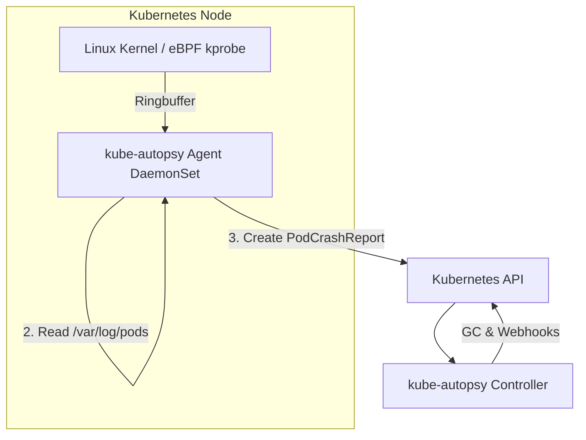

# kube-autopsy

`kube-autopsy` is a low-overhead Kubernetes diagnostic tool designed to capture
the exact system state immediately preceding a pod's termination
(like`OOMKilled` events). By leveraging native eBPF tracing, it intercepts the
Linux Out-Of-Memory (OOM) killer to securely extract high-resolution memory
contexts and last-gasp logs before the container runtime destroys the pod's filesystem
and cgroup.

## Architecture Overview

The application is deployed across your cluster in two parts, operating in
tandem to extract and manage diagnostic data:

1. **The Node Agent (DaemonSet)**: Runs on every node in the cluster with
   privileged access. It uses eBPF (Extended Berkeley Packet Filter) to attach
   a `kprobe` to the kernel's `oom_kill_process` function.
2. **The Controller (Deployment)**: A central operator that manages the
   lifecycle of the resulting reports (e.g., Garbage Collection, status
   updates, routing webhooks).



### The Magic of eBPF
Traditional OOM diagnostic tools rely on polling the `memory.events` file in
cgroups. While this detects an OOM occurred, it cannot reveal *which* process
triggered the OOM, nor can it provide a breakdown of memory. 

`kube-autopsy` compiles portable CO-RE (Compile Once, Run Everywhere) eBPF
bytecode that directly reads the kernel's `mm_struct`. When a pod crashes, the
agent is instantly notified and streams the precise memory breakdown, the exact
triggering PID, the victim PID, and the kernel OOM scores into user-space via a
zero-copy ringbuffer.

## What it Reports

When a pod crashes, the agent automatically creates a `PodCrashReport` Custom
Resource Definition (CRD). The report bridges the gap between raw Linux PIDs
and Kubernetes semantics.

### Diagnostic Payload
* **Trigger Process (`triggerComm`, `triggerPid`)**: The exact process name and PID that allocated the memory causing the threshold to breach.
* **Victim Process (`oomVictimComm`, `oomVictimPid`)**: The process that the Linux OOM killer chose to terminate.
* **OOM Scores (`oomScore`, `oomScoreAdj`)**: The kernel's heuristic score representing how "bad" the process was behaving, used to select the victim.
* **Peak Memory (`peakMemoryBytes`)**: The total amount of memory consumed by the container at the time of death.
* **OOM Context (`oomContext`)**: Determines if the crash was due to `ContainerLimit` (the pod hit its cgroup limit) or `NodeExhaustion` (the underlying physical node ran out of memory).
* **Memory Dissection (`rssDissection`)**: A byte-precise breakdown of the victim's memory, including Anonymous RSS, File RSS, and Page Tables.
* **Final Log Tails (`lastLogLines`)**: The final 50 lines of standard output/error from the container before it was terminated.

## Installation

### Prerequisites
* Kubernetes **1.20+**
* Nodes must run Linux with **cgroups v2** (unified hierarchy).
* The cluster must allow `privileged: true` DaemonSets.

### Deploying to your cluster

You can easily install the latest release directly using the pre-compiled manifest:

```bash
kubectl apply -f https://github.com/stone/kube-autopsy/releases/latest/download/install.yaml
```

Verify that the components are running:
```bash
kubectl get pods -n kube-autopsy
```

## Usage and Examples

Once deployed, `kube-autopsy` runs silently in the background. If any pod in
your cluster gets `OOMKilled`, a `PodCrashReport` is instantly generated in the
same namespace as the crashed pod.

### Listing Crash Reports
You can query crash reports using standard `kubectl` commands. The tool
registers the `pcr` shortname for convenience:

```bash
# List all crash reports in the current namespace
kubectl get pcr

# Output example:
# NAME                                      POD          CONTAINER   REASON      EXIT   NODE       PHASE       AGE
# oom-victim-hogger-20260718-132428         oom-victim   hogger      OOMKilled   137    node-1     Processed   2m
```

### Viewing a Full Crash Report
To see the rich diagnostic data, output the report as YAML or JSON:

```bash
kubectl get pcr oom-victim-hogger-20260718-132428 -o yaml
```

**Example Output:**
```yaml
apiVersion: autopsy.io/v1alpha1
kind: PodCrashReport
metadata:
  name: oom-victim-hogger-20260718-132428
  namespace: default
spec:
  podName: oom-victim
  containerName: hogger
  nodeName: node-1
  terminationReason: OOMKilled
  exitCode: 137
  timestamp: "2026-07-18T13:24:28Z"
status:
  phase: Processed
  diagnostics:
    oomContext: ContainerLimit
    triggerComm: "dd"
    triggerPid: 2993784
    oomVictimComm: "sh"
    oomVictimPid: 2993762
    oomScore: 26879
    oomScoreAdj: 996
    peakMemoryBytes: 4362072064
    rssDissection:
      anonRssBytes: 62812160
      fileRssBytes: 1019904
      pageTablesBytes: 176128
    lastLogLines:
      - "Allocated block 41 (~1MB each)"
      - "Allocated block 42 (~1MB each)"
      - "Allocated block 43 (~1MB each)"
```

### Correlating with Workloads
Notice that the `PodCrashReport` automatically sets its `ownerReference` to the
Pod that crashed. This means if you delete the crashed pod (or if a Deployment
recycles it), the associated `PodCrashReport` will be automatically
garbage-collected by the Kubernetes control plane. 

You can also use this feature to query reports tied to specific pods via label
selectors or owner queries. Note that `kube-autopsy` also runs an active
background Garbage Collector that cleans up reports older than 24 hours
automatically.

### Advanced Filtering and Querying

Because `kube-autopsy` populates the `spec` and `status` with rich metadata, you can use `kubectl`'s native JSONPath to filter reports for specific workloads.

**Find all crash reports for a specific pod (e.g., `oom-victim`):**
```bash
kubectl get pcr -o jsonpath='{.items[?(@.spec.podName=="oom-victim")].metadata.name}'
```

**Find all OOM reports triggered by a specific process (e.g., `java`):**
```bash
kubectl get pcr -o jsonpath='{range .items[?(@.status.diagnostics.triggerComm=="java")]}{.metadata.name}{"\n"}{end}'
```

**Show the Peak Memory (in MB) for all crashes in the cluster:**
```bash
kubectl get pcr -o custom-columns=NAME:.metadata.name,POD:.spec.podName,PEAK_MEM_MB:.status.diagnostics.peakMemoryBytes \
  | awk 'NR>1 {$3=int($3/1024/1024)" MB"; print} NR==1 {print}'
```

**Extract the byte-precise memory footprint (RSS Dissection) of a specific crash:**
```bash
kubectl get pcr oom-victim-hogger-20260718 -o jsonpath='{.status.diagnostics.rssDissection}'
# Output: {"anonRssBytes":62812160,"fileRssBytes":1019904,"pageTablesBytes":176128}
```

### K9s Integration
If you use [k9s](https://k9scli.io/), you can supercharge your debugging experience using our official plugin! 

Simply copy the provided configuration file into your local k9s plusin configuration directory (usually `~/.config/k9s/plugins/`):
```bash
curl https://raw.githubusercontent.com/stone/kube-autopsy/refs/heads/main/integrations/k9s/plugins.yml -O ~/.config/k9s/plugins/kube-autopsy.yml
```

Once installed, you'll gain the following shortcuts in the `k9s` UI:
- `Shift-C` (While selecting a **Pod**): Instantly queries the cluster and opens the associated `PodCrashReport` if the pod crashed.
- `l` (While selecting a **PodCrashReport**): Extracts and cleanly formats the final `lastLogLines` from the crash payload.
- `m` (While selecting a **PodCrashReport**): Opens a parsed view of the exact eBPF memory footprint and OOM Context via `jq`.

## Observability and Webhooks

`kube-autopsy` ships with enterprise-grade observability features:

### Prometheus Metrics
The Controller exposes a native `:8080/metrics` endpoint that exports rich contextual Prometheus metrics, allowing you to build detailed dashboards:
- `kube_autopsy_victim_anon_rss_bytes` (Histogram): Tracks the exact Anonymous RSS footprint of crashed containers.
- `kube_autopsy_trigger_processes_total` (Counter): Tracks which specific applications (e.g. `java`, `node`) are triggering OOM events.
- `kube_autopsy_reports_created_total` (Counter): Tracks overall crash volumes by namespace and node.

### Slack Webhooks
You can configure the controller to dispatch alerts to Slack by setting the `--webhook-url` flag. When a pod crashes, the controller immediately dispatches a rich payload directly to your channel:
```
🚨 Pod Crash Detected
Pod: default/oom-victim (container: hogger)
Node: node-1
Reason: OOMKilled (exit code: 137)
OOM Context: ContainerLimit
Trigger Process: dd (PID: 2993784)
Victim Process: sh (PID: 2993762)
Peak Memory: 4160 MB
Time: 2026-07-18T13:24:28Z
```
