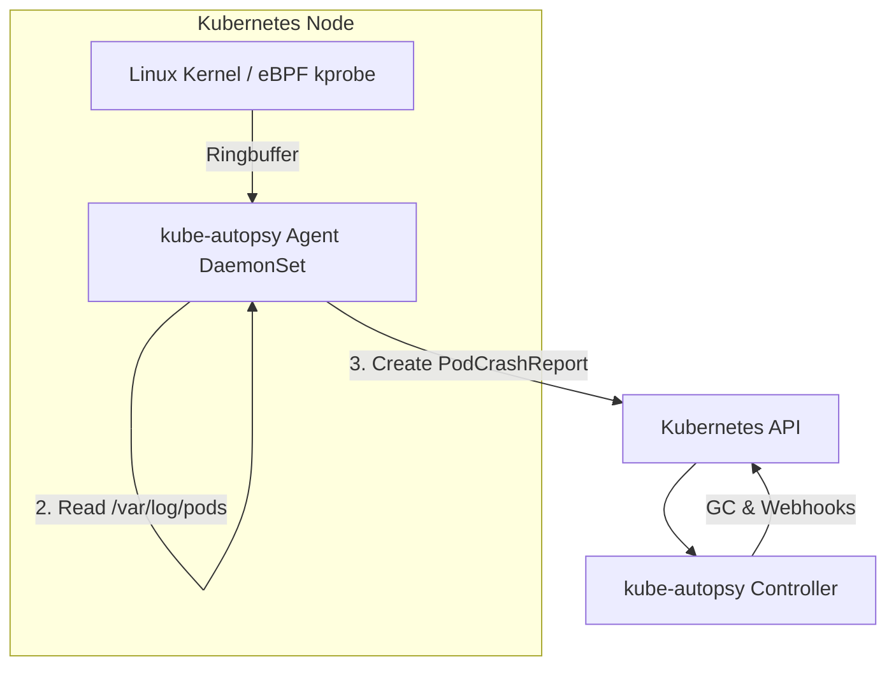

# kube-autopsy

`kube-autopsy` captures why a container was `OOMKilled`, before the container
runtime destroys the evidence. An eBPF kprobe on the kernel's `oom_kill_process`
extracts the memory breakdown, the triggering and victim PIDs, the OOM scores and
the container's last log lines into a `PodCrashReport` in the crashed pod's
namespace. Polling cgroup `memory.events`, the usual approach, tells you a kill
happened but not who caused it or what the victim was using; reading `mm_struct`
from a CO-RE program tells you both.

## How it works

- **Agent (DaemonSet)** on every node: attaches the kprobe, resolves the
  victim's cgroup to a pod, and creates the report. Runs privileged or with just
  `CAP_BPF`/`CAP_PERFMON`, depending on the manifest — see
  [Which manifest to install](#which-manifest-to-install).
- **Controller (Deployment)**: processes reports, emits Events, sends webhooks,
  garbage-collects by age.


```mermaid
graph TD
    subgraph Node[Kubernetes Node]
        K[Linux Kernel / eBPF kprobe] -->|Ringbuffer| A[kube-autopsy Agent DaemonSet]
        A -->|1. Parse Event| A
        A -->|2. Read /var/log/pods| A
    end

    A -->|3. Create PodCrashReport| API[Kubernetes API]
    API --> C[kube-autopsy Controller]
    C -->|GC & Webhooks| API
```

## What a report contains

| Field | Meaning |
|---|---|
| `triggerComm`, `triggerPid` | The process whose allocation breached the limit. |
| `oomVictimComm`, `oomVictimPid` | The process the kernel chose to kill. |
| `oomScore`, `oomScoreAdj` | The victim's badness points and the bias applied. `oomScore` is `oom_control`'s `chosen_points` in pages, not the 0-1000 value in `/proc/<pid>/oom_score`. |
| `victimRssBytes` | Resident memory the victim was using when selected — anonymous, file-backed and shared, matching the kernel's own `get_mm_rss()`. |
| `rssDissection` | Byte-precise split of that: anonymous, file-backed and shared RSS, plus swap and page tables. Anon + file + shmem is `victimRssBytes`; adding swap and page tables gives the figure the kernel scored the victim on. |
| `oomScopeLimitBytes` | Memory available to the scope that OOMed — the container's limit, or node RAM for a `NodeExhaustion` kill. A capacity, not a usage figure. |
| `oomContext` | `ContainerLimit` (the cgroup limit was hit) or `NodeExhaustion` (the node ran out). |
| `lastLogLines` | The container's final log lines, 50 by default. Captured by the quickstart manifest only — see [Log capture and access control](docs/security.md#log-capture-and-access-control). |

[docs/reports.md](docs/reports.md) has a full report and how to query for one.

## Prerequisites

* Kubernetes **1.20+**, on `linux/amd64` or `linux/arm64` nodes.
* **Linux 5.8+** on every node, for both manifests: events are streamed over a
  BPF ring buffer, which earlier kernels do not have, so the program will not
  load however privileged the agent is.
* **cgroups v2** (unified hierarchy). The agent checks this at startup and
  refuses to run on v1 rather than tracing kills it could never attribute to a
  pod.
* Kernel BTF at `/sys/kernel/btf/vmlinux`, i.e. `CONFIG_DEBUG_INFO_BTF=y`, which
  CO-RE requires; the agent says so at startup if it is missing. Debian 11+,
  Ubuntu 20.10+, RHEL 8.2+ and Amazon Linux 2023 all ship it. This is separate
  from the 5.8 floor — RHEL 8's 4.18 kernel has BTF, but ring buffer support
  depends on the point release.
* `oom_kill_process` in `/proc/kallsyms`. It is a static function, so a kernel
  that inlines it entirely cannot be traced.
* The `kube-autopsy` namespace is labelled for the `privileged` Pod Security
  Standard — required either way, since no lower level permits `CAP_BPF`.

## Installation

```bash
kubectl apply -f https://github.com/stone/kube-autopsy/releases/latest/download/install.yaml
kubectl get pods -n kube-autopsy -w
```

That is the whole install. To see it work, kill something:

```bash
kubectl apply -f - <<'EOF'
apiVersion: v1
kind: Pod
metadata:
  name: oom-demo
spec:
  restartPolicy: Never
  containers:
    - name: hogger
      image: alpine:3.20
      command: ["sh", "-c", "i=0; while true; do eval mem_$i=$(head -c 1000000 /dev/zero | tr '\\0' 'x'); i=$((i+1)); echo \"allocated block $i\"; done"]
      resources:
        limits:
          memory: 64Mi
EOF

kubectl get pcr -w            # a report appears within a second or two of the kill
kubectl get pcr -o yaml
kubectl delete pod oom-demo
```

If the agent does not come up, see
[Troubleshooting](docs/troubleshooting.md).

### Which manifest to install

Two are published with every release. Same code, different posture.

| | `install.yaml` (quickstart) | `install-hardened.yaml` |
|---|---|---|
| Agent | `privileged: true` | unprivileged: `CAP_BPF`, `CAP_PERFMON`, `CAP_SYS_RESOURCE` |
| Minimum kernel | **5.8+** | **5.8+** |
| Nested runtimes (kind, minikube, Docker Desktop) | works | may not load eBPF |
| Metrics | plain HTTP on `:8080` | TLS on `:8443`, authenticated + authorized |
| Scraping setup | none | bind `kube-autopsy-metrics-reader` to Prometheus |
| Container logs in reports | captured | not captured |
| NetworkPolicies | none | default-deny ingress plus a metrics allowance |
| Separate ServiceAccounts | yes | yes |

**Start with the quickstart**: it works on the widest range of clusters, and the
first report you open contains logs. Privileged buys nested and locked-down
runtimes — kind, minikube, Docker Desktop, hosts whose seccomp or AppArmor policy
denies `bpf(2)` to a merely capable process. It does **not** lower the 5.8 kernel
floor, which comes from the ring buffer rather than from capabilities.

**Move to hardened** for a shared or multi-tenant cluster, or wherever reading
`PodCrashReports` should not imply being able to read application logs:

```bash
kubectl apply -f https://github.com/stone/kube-autopsy/releases/latest/download/install-hardened.yaml
```

Both are plain Kustomize overlays, installable from a checkout:

```bash
kubectl apply -k deploy/overlays/quickstart   # or: make deploy
kubectl apply -k deploy/overlays/hardened     # or: make deploy-hardened
```

They are end points rather than the only options — every difference between them
is a flag, so you can harden one axis at a time. See
[Configuration](docs/configuration.md).

## Documentation

- [Reading reports](docs/reports.md) — querying by label and JSONPath, and a full report.
- [Configuration](docs/configuration.md) — every flag and environment variable, retention, report lifecycle.
- [Security](docs/security.md) — log capture and access control, component privileges and RBAC, webhook credentials.
- [Integrations](docs/integrations.md) — Prometheus metrics, Kubernetes Events, webhooks, k9s.
- [Troubleshooting](docs/troubleshooting.md) — what each startup failure means.
- [Development](docs/development.md) — building, testing, generated files.
