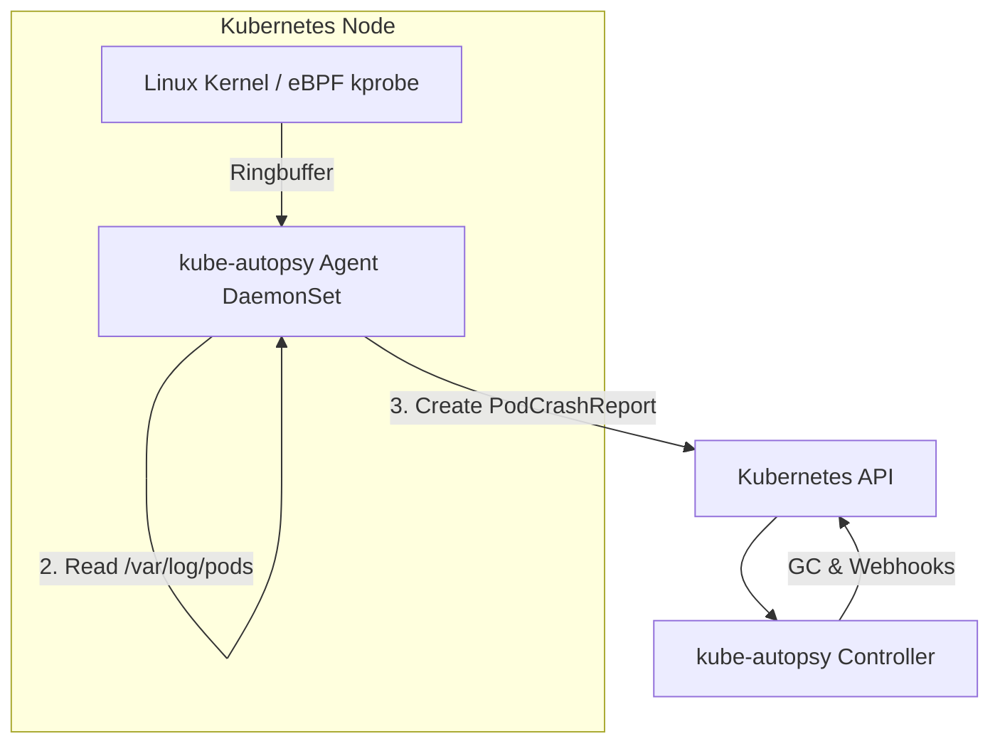

# kube-autopsy

`kube-autopsy` captures why a container was `OOMKilled`, before the container
runtime destroys the evidence. An eBPF kprobe on the kernel's `oom_kill_process`
extracts the memory breakdown, the triggering and victim PIDs, the OOM scores and
the container's last log lines into a `PodCrashReport` in the crashed pod's
namespace. Polling cgroup `memory.events`, the usual approach, tells you a kill
happened but not who caused it or what the victim was using; reading `mm_struct`
from a CO-RE program tells you both.

## How it works

- **Agent (DaemonSet)** on every node: attaches the kprobe, resolves the
  victim's cgroup to a pod, and creates the report. Runs privileged or with just
  `CAP_BPF`/`CAP_PERFMON`, depending on the manifest — see
  [Which manifest to install](#which-manifest-to-install).
- **Controller (Deployment)**: processes reports, emits Events, sends webhooks,
  garbage-collects by age.


```mermaid
graph TD
    subgraph Node[Kubernetes Node]
        K[Linux Kernel / eBPF kprobe] -->|Ringbuffer| A[kube-autopsy Agent DaemonSet]
        A -->|1. Parse Event| A
        A -->|2. Read /var/log/pods| A
    end

    A -->|3. Create PodCrashReport| API[Kubernetes API]
    API --> C[kube-autopsy Controller]
    C -->|GC & Webhooks| API
```

## What a report contains

| Field | Meaning |
|---|---|
| `triggerComm`, `triggerPid` | The process whose allocation breached the limit. |
| `oomVictimComm`, `oomVictimPid` | The process the kernel chose to kill. |
| `oomScore`, `oomScoreAdj` | The victim's badness points and the bias applied. `oomScore` is `oom_control`'s `chosen_points` in pages, not the 0-1000 value in `/proc/<pid>/oom_score`. |
| `victimRssBytes` | Resident memory (anonymous plus file-backed) the victim was using when selected. |
| `rssDissection` | Byte-precise split of that: anonymous RSS, file RSS, page tables. |
| `oomScopeLimitBytes` | Memory available to the scope that OOMed — the container's limit, or node RAM for a `NodeExhaustion` kill. A capacity, not a usage figure. |
| `oomContext` | `ContainerLimit` (the cgroup limit was hit) or `NodeExhaustion` (the node ran out). |
| `lastLogLines` | The container's final log lines, 50 by default. Captured by the quickstart manifest only — see [Log capture and access control](#log-capture-and-access-control). |

## Installation

```bash
kubectl apply -f https://github.com/stone/kube-autopsy/releases/latest/download/install.yaml
kubectl get pods -n kube-autopsy -w
```

That is the whole install. To see it work, kill something:

```bash
kubectl apply -f - <<'EOF'
apiVersion: v1
kind: Pod
metadata:
  name: oom-demo
spec:
  restartPolicy: Never
  containers:
    - name: hogger
      image: alpine:3.20
      command: ["sh", "-c", "i=0; while true; do eval mem_$i=$(head -c 1000000 /dev/zero | tr '\\0' 'x'); i=$((i+1)); echo \"allocated block $i\"; done"]
      resources:
        limits:
          memory: 64Mi
EOF

kubectl get pcr -w            # a report appears within a second or two of the kill
kubectl get pcr -o yaml
kubectl delete pod oom-demo
```

### Which manifest to install

Two are published with every release. Same code, different posture.

| | `install.yaml` (quickstart) | `install-hardened.yaml` |
|---|---|---|
| Agent | `privileged: true` | unprivileged: `CAP_BPF`, `CAP_PERFMON`, `CAP_SYS_RESOURCE` |
| Minimum kernel | **5.8+** | **5.8+** |
| Nested runtimes (kind, minikube, Docker Desktop) | works | may not load eBPF |
| Metrics | plain HTTP on `:8080` | TLS on `:8443`, authenticated + authorized |
| Scraping setup | none | bind `kube-autopsy-metrics-reader` to Prometheus |
| Container logs in reports | captured | not captured |
| NetworkPolicies | none | default-deny ingress plus a metrics allowance |
| Separate ServiceAccounts | yes | yes |

**Start with the quickstart**: it works on the widest range of clusters, and the
first report you open contains logs. Privileged buys nested and locked-down
runtimes — kind, minikube, Docker Desktop, hosts whose seccomp or AppArmor policy
denies `bpf(2)` to a merely capable process. It does **not** lower the 5.8 kernel
floor, which comes from the ring buffer rather than from capabilities.

**Move to hardened** for a shared or multi-tenant cluster, or wherever reading
`PodCrashReports` should not imply being able to read application logs:

```bash
kubectl apply -f https://github.com/stone/kube-autopsy/releases/latest/download/install-hardened.yaml
```

Both are plain Kustomize overlays, installable from a checkout:

```bash
kubectl apply -k deploy/overlays/quickstart   # or: make deploy
kubectl apply -k deploy/overlays/hardened     # or: make deploy-hardened
```

### Mixing and matching

The overlays are end points, not the only options — every difference is a flag,
so you can harden one axis at a time. To keep the quickstart but stop copying
logs into reports:

```bash
kubectl -n kube-autopsy patch daemonset kube-autopsy-agent --type=json \
  -p='[{"op":"replace","path":"/spec/template/spec/containers/0/args",
        "value":["agent","--capture-logs=false","--metrics-secure=false","--metrics-bind-addr=:8080"]}]'
```

### Prerequisites

* Kubernetes **1.20+**, on `linux/amd64` or `linux/arm64` nodes.
* **Linux 5.8+** on every node, for both manifests: events are streamed over a
  BPF ring buffer, which earlier kernels do not have, so the program will not
  load however privileged the agent is.
* **cgroups v2** (unified hierarchy).
* Kernel BTF at `/sys/kernel/btf/vmlinux`, i.e. `CONFIG_DEBUG_INFO_BTF=y`, which
  CO-RE requires; the agent says so at startup if it is missing. Debian 11+,
  Ubuntu 20.10+, RHEL 8.2+ and Amazon Linux 2023 all ship it. This is separate
  from the 5.8 floor — RHEL 8's 4.18 kernel has BTF, but ring buffer support
  depends on the point release.
* `oom_kill_process` in `/proc/kallsyms`. It is a static function, so a kernel
  that inlines it entirely cannot be traced.
* The `kube-autopsy` namespace is labelled for the `privileged` Pod Security
  Standard — required either way, since no lower level permits `CAP_BPF`.

Linux 6.2 changed how per-process RSS counters are stored; the agent reads both
layouts, so `victimRssBytes` and `rssDissection` work on older kernels (Debian 12,
RHEL 9, Ubuntu 22.04, Amazon Linux 2023) too. If neither is present those fields
are **omitted** rather than zeroed, so an absent value is never mistaken for a
container that used no memory.

### Troubleshooting

**Agent is `CrashLoopBackOff`.** It names each failed precondition, so read the
logs: `kubectl -n kube-autopsy logs -l app.kubernetes.io/component=agent --tail=20`

* `kernel BTF is required for CO-RE but could not be loaded` — the node lacks
  `CONFIG_DEBUG_INFO_BTF`. No workaround short of a kernel that has it.
* `attaching kprobe to oom_kill_process` — the message says whether the symbol is
  missing from `/proc/kallsyms` or has been inlined. If it is present, a
  sandboxed or nested runtime is likely denying `bpf(2)`; the quickstart
  overlay's privileged agent gets past most of those.
* Failure to load the program at all, before any attach, on a pre-5.8 kernel —
  the ring buffer does not exist there. No workaround on either overlay.

**No report after an OOM kill.** Check the agent on that node. A kill whose
cgroup belongs to no pod — a global OOM that took a systemd unit — is skipped by
design and logged at `-v=1`.

**`lastLogLines` is empty.** Log capture is off unless `--capture-logs=true`; the
hardened overlay leaves it off deliberately.

**`rssDissection` is missing.** The kernel presented neither `mm_struct` layout.
The rest of the report is still valid.

**`kubectl get pcr` is empty after a rollout.** Reports are not deleted with
their pod by default, so check `--ttl-hours` (24) instead.

## Configuration

Every flag has a `KUBE_AUTOPSY_` environment equivalent — uppercase, dashes to
underscores, so `--ttl-hours` is `KUBE_AUTOPSY_TTL_HOURS`. Precedence is
flag > environment > default, so these can come from a ConfigMap or Secret. Both
subcommands accept the whole set; the column below is what acts on each.

| Flag | Default | Honoured by | Purpose |
|---|---|---|---|
| `--capture-logs` | `false` | agent | Copy the container's final log lines into the report. Read [Log capture and access control](#log-capture-and-access-control) first. |
| `--log-tail-lines` | `50` | agent | Lines captured per container, additionally truncated to 2KiB per line and 64KiB per report. |
| `--report-cooldown-seconds` | `30` | agent | Suppress repeat reports for the same container within this window, so a tight crash loop cannot report forever. `0` disables. |
| `--max-concurrent-reports` | `8` | agent | Reports written at once, so a burst of kills cannot flood the API server. |
| `--pod-owner-reference` | `false` | agent | Own each report by its pod, deleting it with the pod. See [Retention and ownership](#retention-and-ownership). |
| `--ttl-hours` | `24` | controller | Age at which the garbage collector deletes a report. |
| `--webhook-include-logs` | `false` | controller | Let captured log lines leave the cluster in the webhook payload. |
| `--webhook-url` | — | controller | **Deprecated**: readable by anyone who can get the pod spec. Use `KUBE_AUTOPSY_WEBHOOK_URL` from a Secret. |
| `--leader-elect` | `true` | controller | Leader election, so replicas do not both process a report. |
| `--metrics-bind-addr` | `:8443` | both | Address for `/metrics`; the quickstart overlay sets `:8080`. |
| `--metrics-secure` | `true` | both | Serve metrics over TLS, requiring each scrape to authenticate and pass a `SubjectAccessReview`. |
| `--health-probe-bind-addr` | `:8081` | both | Address for health and readiness probes. |

`KUBE_AUTOPSY_WEBHOOK_AUTH_HEADER` has no flag at all: it is a credential, and a
flag value is visible in the pod spec and in process listings.

Values that would silently lose data are rejected at startup — `--ttl-hours`
below 1 would make the collector delete every report on its first pass, and
`--log-tail-lines` below 1 is not a meaningful capture request.

## Security

### Log capture and access control

The quickstart manifest captures container logs; the hardened one does not, and
the binary's own default is off.

This is about access control, not overhead. Reading a container's logs normally
requires `get pods/log`; copied into a `PodCrashReport`, those lines become
readable by anyone with `get podcrashreports` in the namespace — a weaker
permission that read-only and developer roles often grant via wildcards. Logs
routinely contain bearer tokens, connection strings and personal data.

So if you keep it on, treat `get podcrashreports` as equivalent to `pods/log` for
those namespaces. Log lines leave the cluster only if you also pass
`--webhook-include-logs=true`.

### Component privileges

The agent and controller have separate ServiceAccounts, so compromising the
node-resident agent does not grant the controller's rights — notably deleting
reports, which on a forensics tool means destroying evidence.

| | Agent | Controller |
|---|---|---|
| `pods` | get, list, watch | — |
| `podcrashreports` | create | get, list, watch, update, patch, delete |
| `podcrashreports/status` | update, patch | update, patch |
| `events` | — | create, patch |
| `leases` (namespaced) | — | leader election |

How privileged the agent itself is depends on the manifest. **Hardened** runs it
unprivileged with `CAP_BPF`, `CAP_PERFMON`, `CAP_SYS_RESOURCE`,
`allowPrivilegeEscalation: false` and `seccompProfile: RuntimeDefault`.
**Quickstart runs it `privileged: true`** — every capability, no seccomp, host
devices exposed — which is the reason to move to hardened once the tool is known
to work in your cluster. Both share a read-only root filesystem, no host PID
namespace, and one host mount: `/var/log/pods`, read-only, used only when log
capture is on.

### Webhook credentials

A webhook URL is a credential: whoever holds it can post to your channel. Supply
it via `KUBE_AUTOPSY_WEBHOOK_URL` from a Secret rather than the deprecated
`--webhook-url` flag, which is readable by anyone who can `get pods`. The
controller never logs the URL beyond its host.

```bash
kubectl -n kube-autopsy create secret generic kube-autopsy-webhook \
  --from-literal=url='https://hooks.slack.com/services/...' \
  --from-literal=authHeader='Bearer optional-token'
```

The shipped Deployment already reads that Secret as `optional`, so creating it is
all that is needed.

## Using the reports

### Finding them

Reports register the `pcr` shortname:

```bash
kubectl get pcr

# NAME                      POD          CONTAINER   REASON      EXIT   NODE       PHASE       AGE
# oom-victim-hogger-x7k2p   oom-victim   hogger      OOMKilled   137    node-1     Processed   2m
```

Names are server-generated from a `<pod>-<container>-` prefix, so a container
killed repeatedly gets one report per kill instead of overwriting the previous
one. Because the suffix is opaque, correlate through the labels every report
carries — they select server-side — or through `spec.podName`/`spec.containerName`:

```bash
kubectl get pcr -l autopsy.tty.se/pod=oom-victim         # one pod
kubectl get pcr -A -l autopsy.tty.se/node=node-1         # everything that died on a node
kubectl get pcr -A -l autopsy.tty.se/container=hogger    # one container, every namespace
```

`spec.podUID` records which pod incarnation a report came from, since pod names
are reused across recreations.

For anything the labels do not cover, the `spec` and `status` are rich enough for
JSONPath:

```bash
# Reports triggered by a particular process
kubectl get pcr -o jsonpath='{range .items[?(@.status.diagnostics.triggerComm=="java")]}{.metadata.name}{"\n"}{end}'

# Victim RSS across the cluster, in MB
kubectl get pcr -o custom-columns=NAME:.metadata.name,POD:.spec.podName,VICTIM_RSS_MB:.status.diagnostics.victimRssBytes \
  | awk 'NR>1 {$3=int($3/1024/1024)" MB"; print} NR==1 {print}'
```

### A full report

```bash
kubectl get pcr oom-victim-hogger-x7k2p -o yaml
```

```yaml
apiVersion: autopsy.tty.se/v1alpha1
kind: PodCrashReport
metadata:
  name: oom-victim-hogger-x7k2p
  namespace: default
  labels:
    autopsy.tty.se/pod: oom-victim
    autopsy.tty.se/container: hogger
    autopsy.tty.se/node: node-1
    autopsy.tty.se/reason: OOMKilled
spec:
  podName: oom-victim
  containerName: hogger
  nodeName: node-1
  terminationReason: OOMKilled
  exitCode: 137
  podUID: 6f1c0f5e-4a2b-4c3d-9e8f-0a1b2c3d4e5f
  timestamp: "2026-07-18T13:24:28Z"
status:
  phase: Processed
  diagnostics:
    oomContext: ContainerLimit
    triggerComm: "dd"
    triggerPid: 2993784
    oomVictimComm: "sh"
    oomVictimPid: 2993762
    oomScore: 26879
    oomScoreAdj: 996
    victimRssBytes: 63832064
    oomScopeLimitBytes: 67108864
    rssDissection:
      anonRssBytes: 62812160
      fileRssBytes: 1019904
      pageTablesBytes: 176128
    lastLogLines:
      - "Allocated block 41 (~1MB each)"
      - "Allocated block 42 (~1MB each)"
      - "Allocated block 43 (~1MB each)"
```

### Retention and ownership

Retention is time-based: a background collector removes reports older than
`--ttl-hours` (24 by default).

Reports are **not** owned by their pod by default. Owning them would let the
control plane delete the report as soon as the pod is recycled, which for a
rollout or a `restartPolicy: Never` pod is seconds after the crash and long
before anyone reads it. Pass `--pod-owner-reference=true` if you would rather
they disappear with their pod.

### Report lifecycle

The agent creates the report in `Pending`, then attaches diagnostics in a second
write because `status` is a subresource. The controller waits for that write, so
an Event and a webhook are never emitted with no memory figures in them; if the
agent dies in between, the report is processed without diagnostics after two
minutes rather than being stranded.

The controller then sends the webhook, marks the report `Processed` with
`status.notifiedAt`, and records the Event — in that order. Sending before the
transition makes delivery at-least-once rather than at-most-once: a failure is
retried with backoff for 10 minutes from creation, after which the report is
marked `Processed` regardless, so a dead endpoint cannot pin everything in
`Pending`. The cost is that a send which succeeds but whose status write fails is
retried, so a receiver may see a duplicate.

### Kubernetes Events

Each processed crash emits an Event on the `PodCrashReport` with reason
`CrashDetected` and type `Warning`, which event-routing tools can forward:
[BotKube](https://botkube.io/) can watch `PodCrashReport` events and relay them
to Slack, Discord and similar; [Robusta](https://robusta.dev/) can trigger
runbooks from them.

### Built-in webhooks

The controller can also dispatch directly, given a URL in the
`kube-autopsy-webhook` Secret (see
[Webhook credentials](#webhook-credentials)). It sends JSON, or a formatted Slack
message when the endpoint's *host* is Slack:

```
🚨 Pod Crash Detected
Pod: default/oom-victim (container: hogger)
Node: node-1
Reason: OOMKilled (exit code: 137)
OOM Context: ContainerLimit
Trigger Process: dd (PID: 2993784)
Victim Process: sh (PID: 2993762)
Victim RSS: 60 MB (scope limit: 64 MB)
Time: 2026-07-18T13:24:28Z
```

### Prometheus metrics

Both components expose `/metrics`, through the `kube-autopsy-controller-metrics`
and `kube-autopsy-agent-metrics` Services. Quickstart serves plain HTTP on
`:8080`, scrapeable with no further setup. Hardened serves TLS on `:8443` and
requires each scrape to authenticate and pass a `SubjectAccessReview`, since
serving in the clear exposes namespace, node, container and process names to
anything that can reach the pod:

```bash
kubectl create clusterrolebinding kube-autopsy-prometheus \
  --clusterrole=kube-autopsy-metrics-reader \
  --serviceaccount=monitoring:prometheus
```

From the controller:

- `kube_autopsy_reports_created_total` (Counter; `namespace`, `node`, `reason`) — crash volume.
- `kube_autopsy_oom_events_total` (Counter; `namespace`, `node`) — OOM kills detected.
- `kube_autopsy_victim_anon_rss_bytes` (Histogram; `namespace`, `container`) — the victim's anonymous RSS.
- `kube_autopsy_trigger_processes_total` (Counter; `comm`) — which applications trigger OOMs.
- `kube_autopsy_report_age_seconds` (Histogram) — age at GC, so you can tell whether `--ttl-hours` discards reports before anyone reads them.

From the agent:

- `kube_autopsy_capture_latency_seconds` (Histogram) — kernel event to report written.
- `kube_autopsy_log_capture_failures_total` (Counter; `namespace`) — log tails lost to the runtime tearing down first.
- `kube_autopsy_reports_suppressed_total` (Counter) — crashes dropped by the cooldown, i.e. deliberately rather than lost.
- `kube_autopsy_report_errors_total` (Counter; `stage`) — crashes not recorded at all, by failing stage.

The `comm` and `container` values are chosen by whoever can create pods, so they
pass through a cardinality limiter rather than reaching Prometheus verbatim.

An alert on any crash:

```yaml
apiVersion: monitoring.coreos.com/v1
kind: PrometheusRule
metadata:
  name: kube-autopsy-alerts
spec:
  groups:
  - name: kube-autopsy.rules
    rules:
    - alert: PodCrashDetected
      expr: increase(kube_autopsy_reports_created_total[5m]) > 0
      for: 0m
      labels:
        severity: warning
      annotations:
        summary: "Pod crash detected by kube-autopsy in namespace {{ $labels.namespace }}"
        description: "A pod crash report was generated for reason {{ $labels.reason }} on node {{ $labels.node }}."
```

### k9s

Copy the [plugin](integrations/k9s/plugins.yml) into your k9s plugin directory:

```bash
mkdir -p ~/.config/k9s/plugins
curl -fsSL https://raw.githubusercontent.com/stone/kube-autopsy/refs/heads/main/integrations/k9s/plugins.yml \
  -o ~/.config/k9s/plugins/kube-autopsy.yml
```

- `Shift-C` on a **Pod** — open its latest `PodCrashReport`, if any.
- `l` on a **PodCrashReport** — the formatted `lastLogLines`.
- `m` on a **PodCrashReport** — the memory footprint and OOM context.

## Development

```bash
make build            # ./bin/kube-autopsy
make fmt vet lint
make test             # unit tests, with -race
make e2e              # end-to-end, in a throwaway kind cluster
```

`make e2e-no-cleanup` keeps the kind cluster for debugging. The suite deploys the
overlay a user would install rather than hand-applying manifests, so it covers
that too; it runs `quickstart` by default, and `OVERLAY=hardened
./test/e2e/run.sh` tests the other, minus the log-tail assertions.

CI fails if a generated file has drifted from its source, so regenerate before
pushing:

| Run | After changing | Produces |
|---|---|---|
| `make generate` | `api/v1alpha1/types.go` | `zz_generated.deepcopy.go`, `deploy/base/crd.yaml` |
| `make generate-bpf` | `internal/agent/bpf/oom.c` | the eBPF objects and Go bindings, per architecture |

Only the Go bindings are compared, not the `.o` files: clang does not emit a
byte-identical object across compiler versions, but the struct layout userspace
depends on must not move silently.

`make btf-fixtures` fetches the kernel BTF blobs the CO-RE relocation tests use
to prove the program resolves against both `mm_struct` layouts. They are several
MB each, so they are fetched rather than committed, and the tests skip without
them — which is why CI fetches them before `go test`.
