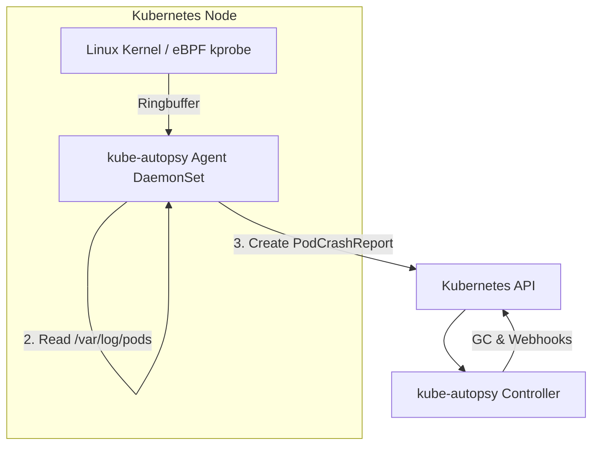

# kube-autopsy

`kube-autopsy` is a low-overhead Kubernetes diagnostic tool designed to capture
the exact system state immediately preceding a pod's termination
(like`OOMKilled` events). By leveraging native eBPF tracing, it intercepts the
Linux Out-Of-Memory (OOM) killer to securely extract high-resolution memory
contexts and last-gasp logs before the container runtime destroys the pod's filesystem
and cgroup.

## Architecture Overview

The application is deployed across your cluster in two parts, operating in
tandem to extract and manage diagnostic data:

1. **The Node Agent (DaemonSet)**: Runs on every node in the cluster. It uses
   eBPF (Extended Berkeley Packet Filter) to attach a `kprobe` to the kernel's
   `oom_kill_process` function. It can run either privileged or with just
   `CAP_BPF` and `CAP_PERFMON`, depending on which manifest you install — see
   [Which manifest to install](#which-manifest-to-install).
2. **The Controller (Deployment)**: A central operator that manages the
   lifecycle of the resulting reports (e.g., Garbage Collection, status
   updates, routing webhooks).


```mermaid
graph TD
    subgraph Node[Kubernetes Node]
        K[Linux Kernel / eBPF kprobe] -->|Ringbuffer| A[kube-autopsy Agent DaemonSet]
        A -->|1. Parse Event| A
        A -->|2. Read /var/log/pods| A
    end

    A -->|3. Create PodCrashReport| API[Kubernetes API]
    API --> C[kube-autopsy Controller]
    C -->|GC & Webhooks| API
```

### The Magic of eBPF
Traditional OOM diagnostic tools rely on polling the `memory.events` file in
cgroups. While this detects an OOM occurred, it cannot reveal *which* process
triggered the OOM, nor can it provide a breakdown of memory. 

`kube-autopsy` compiles portable CO-RE (Compile Once, Run Everywhere) eBPF
bytecode that directly reads the kernel's `mm_struct`. When a pod crashes, the
agent is instantly notified and streams the precise memory breakdown, the exact
triggering PID, the victim PID, and the kernel OOM scores into user-space via a
zero-copy ringbuffer.

## What it Reports

When a pod crashes, the agent automatically creates a `PodCrashReport` Custom
Resource Definition (CRD). The report bridges the gap between raw Linux PIDs
and Kubernetes semantics.

### Diagnostic Payload
* **Trigger Process (`triggerComm`, `triggerPid`)**: The exact process name and PID that allocated the memory causing the threshold to breach.
* **Victim Process (`oomVictimComm`, `oomVictimPid`)**: The process that the Linux OOM killer chose to terminate.
* **OOM Scores (`oomScore`, `oomScoreAdj`)**: The kernel's "badness" points for the victim (measured in pages), and the `oom_score_adj` bias applied to it. Note that `oomScore` is `oom_control`'s `chosen_points`, not the 0-1000 value in `/proc/<pid>/oom_score`.
* **Victim RSS (`victimRssBytes`)**: The resident memory (anonymous plus file-backed) the killed process was actually using when the OOM killer selected it.
* **OOM Scope Limit (`oomScopeLimitBytes`)**: The memory available to the scope the kill happened in — the container's limit for a `ContainerLimit` kill, or the node's total RAM for `NodeExhaustion`. This is a capacity, not a measurement of usage.
* **OOM Context (`oomContext`)**: Determines if the crash was due to `ContainerLimit` (the pod hit its cgroup limit) or `NodeExhaustion` (the underlying physical node ran out of memory).
* **Memory Dissection (`rssDissection`)**: A byte-precise breakdown of the victim's memory, including Anonymous RSS, File RSS, and Page Tables.
* **Final Log Tails (`lastLogLines`)**: The final 50 lines of standard output/error from the container before it was terminated. Captured by the quickstart manifest, off in the hardened one — see [Log capture and access control](#log-capture-and-access-control).

## Installation

### Quickstart

```bash
kubectl apply -f https://github.com/stone/kube-autopsy/releases/latest/download/install.yaml
```

That is the whole install. Watch it come up:

```bash
kubectl get pods -n kube-autopsy -w
```

Then make something die and read the report:

```bash
kubectl apply -f - <<'EOF'
apiVersion: v1
kind: Pod
metadata:
  name: oom-demo
spec:
  restartPolicy: Never
  containers:
    - name: hogger
      image: alpine:3.20
      command: ["sh", "-c", "i=0; while true; do eval mem_$i=$(head -c 1000000 /dev/zero | tr '\\0' 'x'); i=$((i+1)); echo \"allocated block $i\"; done"]
      resources:
        limits:
          memory: 64Mi
EOF

kubectl get pcr -w            # a report appears within a second or two of the kill
kubectl get pcr -o yaml
kubectl delete pod oom-demo
```

### Which manifest to install

Two are published with every release. They deploy the same code and differ only
in posture.

| | `install.yaml` (quickstart) | `install-hardened.yaml` |
|---|---|---|
| Agent | `privileged: true` | unprivileged: `CAP_BPF`, `CAP_PERFMON`, `CAP_SYS_RESOURCE` |
| Minimum kernel | any supported | **5.8+** (older kernels lack those capabilities) |
| Nested runtimes (kind, minikube, Docker Desktop) | works | may not load eBPF |
| Metrics | plain HTTP on `:8080` | TLS on `:8443`, authenticated + authorized |
| Scraping setup | none | bind `kube-autopsy-metrics-reader` to Prometheus |
| Container logs in reports | captured | not captured |
| NetworkPolicies | none | default-deny ingress plus a metrics allowance |
| Separate ServiceAccounts | yes | yes |

**Start with the quickstart.** It is chosen so a first install works on the
widest range of clusters and so the first report you open contains the log tail
the tool is advertised for.

**Move to hardened for a shared or multi-tenant cluster**, or any cluster where
someone who can read `PodCrashReports` should not thereby be able to read
application logs:

```bash
kubectl apply -f https://github.com/stone/kube-autopsy/releases/latest/download/install-hardened.yaml
```

Both are plain Kustomize overlays, so you can also install from a checkout and
adjust them:

```bash
kubectl apply -k deploy/overlays/quickstart   # or: make deploy
kubectl apply -k deploy/overlays/hardened     # or: make deploy-hardened
```

### Mixing and matching

The two overlays are end points, not the only options. Each difference is an
independent flag, so you can harden one axis at a time. To keep the quickstart
but stop copying logs into reports:

```bash
kubectl -n kube-autopsy patch daemonset kube-autopsy-agent --type=json \
  -p='[{"op":"replace","path":"/spec/template/spec/containers/0/args",
        "value":["agent","--capture-logs=false","--metrics-secure=false","--metrics-bind-addr=:8080"]}]'
```

Every flag also reads from a `KUBE_AUTOPSY_`-prefixed environment variable, so
these can equally be set from a ConfigMap or Secret. Precedence is
flag > environment > default.

### Prerequisites
* Kubernetes **1.20+**
* `linux/amd64` and `linux/arm64` nodes are both supported.
* Nodes must run Linux with **cgroups v2** (unified hierarchy).
* Nodes must expose kernel BTF at `/sys/kernel/btf/vmlinux`, which requires the
  kernel to be built with `CONFIG_DEBUG_INFO_BTF=y`. CO-RE cannot work without
  it; the agent reports this explicitly at startup rather than failing obscurely.
  Stock kernels from Debian 11+, Ubuntu 20.10+, RHEL 8.2+ and Amazon Linux 2023
  all have it. Check with `ls /sys/kernel/btf/vmlinux`.
* The kernel must expose `oom_kill_process` in `/proc/kallsyms`. It is a static
  function, so a kernel that inlines it entirely cannot be traced; the agent
  says so on startup if that is the case.
* The `kube-autopsy` namespace is labelled for the `privileged` Pod Security
  Standard. This is required either way: even the hardened agent holds `CAP_BPF`,
  which no lower PSS level permits.

#### A note on kernel versions and memory figures
Linux 6.2 changed how the kernel stores per-process RSS counters. `kube-autopsy`
reads both layouts, so `victimRssBytes` and `rssDissection` are populated on
older kernels (Debian 12, RHEL 9, Ubuntu 22.04, Amazon Linux 2023) as well as
newer ones. If a kernel presents neither layout, those fields are **omitted**
from the report rather than reported as zero, so an absent value is never
mistaken for a container that used no memory.

### Troubleshooting

**Agent pod is `CrashLoopBackOff`.** Read the logs first — the agent reports
each precondition by name rather than failing generically:

```bash
kubectl -n kube-autopsy logs -l app.kubernetes.io/component=agent --tail=20
```

* `kernel BTF is required for CO-RE but could not be loaded` — the node kernel
  lacks `CONFIG_DEBUG_INFO_BTF`. There is no workaround short of a kernel that
  has it.
* `attaching kprobe to oom_kill_process` — on the hardened overlay this usually
  means the kernel is older than 5.8, so `CAP_BPF` and `CAP_PERFMON` do not
  exist. Switch to the quickstart overlay. The message says explicitly if the
  symbol is missing or has been inlined instead.

**No `PodCrashReport` appears after an OOM kill.** Check the agent on the node
where the pod was running. A crash whose cgroup belongs to no pod — a global OOM
that killed a systemd unit, say — is skipped by design, and logged at `-v=1`.

**Reports appear but `lastLogLines` is empty.** Log capture is off unless
`--capture-logs=true`; the hardened overlay leaves it off deliberately.

**Reports appear but `rssDissection` is missing.** The node kernel presented
neither known `mm_struct` layout. Everything else in the report is still valid.

**`kubectl get pcr` returns nothing after a rollout.** Reports are not deleted
with their pod by default, so this is not it — check `--ttl-hours` (24 by
default) instead.

## Security

### Log capture and access control
The **quickstart** manifest captures container logs; the **hardened** manifest
does not. The binary's own default is off, so anything that does not explicitly
pass `--capture-logs=true` will not collect them.

The reason this is a choice at all is access control, not overhead. Reading a container's logs normally
requires `get pods/log`. Once those lines are copied into a `PodCrashReport`,
anyone who can `get podcrashreports` in that namespace can read them — a weaker
permission that read-only and developer roles frequently grant via wildcards.
Application logs routinely contain bearer tokens, connection strings and
personal data, so enabling this effectively widens who can see them.

If you keep it enabled:
* Review who holds `get podcrashreports`, and treat it as equivalent to
  `pods/log` for those namespaces.
* Captured output is truncated to 2KiB per line and 64KiB in total, so a report
  can never grow past etcd's per-object limit and fail to be written.
* Log lines are **not** sent to webhooks unless you also pass
  `--webhook-include-logs=true`, which sends them outside the cluster.

### Component privileges
The agent and the controller have separate ServiceAccounts, so compromising the
node-resident agent does not also grant the controller's rights — notably the
ability to delete crash reports, which on a forensics tool means destroying
evidence.

| | Agent | Controller |
|---|---|---|
| `pods` | get, list, watch | — |
| `podcrashreports` | create | get, list, watch, update, patch, delete |
| `podcrashreports/status` | update, patch | update, patch |
| `events` | — | create, patch |
| `leases` (namespaced) | — | leader election |

The agent runs unprivileged with `CAP_BPF`, `CAP_PERFMON` and `CAP_SYS_RESOURCE`,
`seccompProfile: RuntimeDefault`, a read-only root filesystem, and no host PID
namespace. Its only host mount is `/var/log/pods`, read-only, and that is used
solely when log capture is enabled.

### Webhook credentials
A webhook URL is a credential: whoever holds it can post to your channel. Supply
it through the `KUBE_AUTOPSY_WEBHOOK_URL` environment variable from a Secret
rather than the deprecated `--webhook-url` flag, whose value is readable in the
pod spec by anyone who can `get pods`. The controller never logs the URL beyond
its host.

```bash
kubectl -n kube-autopsy create secret generic kube-autopsy-webhook \
  --from-literal=url='https://hooks.slack.com/services/...' \
  --from-literal=authHeader='Bearer optional-token'
```

The shipped Deployment already reads that Secret, marked `optional`, so creating
it is all that is required.

## Usage and Examples

Once deployed, `kube-autopsy` runs silently in the background. If any pod in
your cluster gets `OOMKilled`, a `PodCrashReport` is instantly generated in the
same namespace as the crashed pod.

### Listing Crash Reports
You can query crash reports using standard `kubectl` commands. The tool
registers the `pcr` shortname for convenience:

```bash
# List all crash reports in the current namespace
kubectl get pcr

# Output example:
# NAME                      POD          CONTAINER   REASON      EXIT   NODE       PHASE       AGE
# oom-victim-hogger-x7k2p   oom-victim   hogger      OOMKilled   137    node-1     Processed   2m
```

Report names are server-generated from the `<pod>-<container>-` prefix, so a
container that is OOM-killed repeatedly produces one report per kill rather than
overwriting the previous one. Use the `spec.podName` / `spec.containerName`
fields rather than the report name when correlating reports to a workload.

### Viewing a Full Crash Report
To see the rich diagnostic data, output the report as YAML or JSON:

```bash
kubectl get pcr oom-victim-hogger-x7k2p -o yaml
```

**Example Output:**
```yaml
apiVersion: autopsy.tty.se/v1alpha1
kind: PodCrashReport
metadata:
  name: oom-victim-hogger-x7k2p
  namespace: default
  labels:
    autopsy.tty.se/pod: oom-victim
    autopsy.tty.se/container: hogger
    autopsy.tty.se/node: node-1
    autopsy.tty.se/reason: OOMKilled
spec:
  podName: oom-victim
  containerName: hogger
  nodeName: node-1
  terminationReason: OOMKilled
  exitCode: 137
  podUID: 6f1c0f5e-4a2b-4c3d-9e8f-0a1b2c3d4e5f
  timestamp: "2026-07-18T13:24:28Z"
status:
  phase: Processed
  diagnostics:
    oomContext: ContainerLimit
    triggerComm: "dd"
    triggerPid: 2993784
    oomVictimComm: "sh"
    oomVictimPid: 2993762
    oomScore: 26879
    oomScoreAdj: 996
    victimRssBytes: 63832064
    oomScopeLimitBytes: 67108864
    rssDissection:
      anonRssBytes: 62812160
      fileRssBytes: 1019904
      pageTablesBytes: 176128
    lastLogLines:
      - "Allocated block 41 (~1MB each)"
      - "Allocated block 42 (~1MB each)"
      - "Allocated block 43 (~1MB each)"
```

### Correlating with Workloads
Reports outlive the pods they describe. Retention is time-based: a background
garbage collector removes reports older than `--ttl-hours` (24 by default).

Reports are **not** owned by their pod by default. Owning them would let the
control plane delete the report the moment the pod is recycled — which for a
Deployment rollout or a `restartPolicy: Never` pod is usually seconds after the
crash, and long before anyone reads it. If you would rather have reports
disappear with their pod, pass `--pod-owner-reference=true` to the agent.

Every report carries labels for server-side selection, so you do not need to
filter the whole collection client-side:

```bash
# All reports for one pod
kubectl get pcr -l autopsy.tty.se/pod=oom-victim

# Everything that died on one node
kubectl get pcr -A -l autopsy.tty.se/node=node-1

# One container across every namespace
kubectl get pcr -A -l autopsy.tty.se/container=hogger
```

`spec.podUID` records which pod incarnation a report came from, since a pod name
is reused across recreations.

### Advanced Filtering and Querying

Because `kube-autopsy` populates the `spec` and `status` with rich metadata, you can use `kubectl`'s native JSONPath to filter reports for specific workloads.

**Find all crash reports for a specific pod (e.g., `oom-victim`):**
```bash
# Prefer the label selector — it filters server-side.
kubectl get pcr -l autopsy.tty.se/pod=oom-victim
```

**Find all OOM reports triggered by a specific process (e.g., `java`):**
```bash
kubectl get pcr -o jsonpath='{range .items[?(@.status.diagnostics.triggerComm=="java")]}{.metadata.name}{"\n"}{end}'
```

**Show the victim's resident memory (in MB) for all crashes in the cluster:**
```bash
kubectl get pcr -o custom-columns=NAME:.metadata.name,POD:.spec.podName,VICTIM_RSS_MB:.status.diagnostics.victimRssBytes \
  | awk 'NR>1 {$3=int($3/1024/1024)" MB"; print} NR==1 {print}'
```

**Extract the byte-precise memory footprint (RSS Dissection) of a specific crash:**
```bash
kubectl get pcr oom-victim-hogger-x7k2p -o jsonpath='{.status.diagnostics.rssDissection}'
# Output: {"anonRssBytes":62812160,"fileRssBytes":1019904,"pageTablesBytes":176128}
```

### K9s Integration
If you use [k9s](https://k9scli.io/), you can supercharge your debugging experience using our official plugin! 

Simply copy the provided configuration file into your local k9s plusin configuration directory (usually `~/.config/k9s/plugins/`):
```bash
curl https://raw.githubusercontent.com/stone/kube-autopsy/refs/heads/main/integrations/k9s/plugins.yml -O ~/.config/k9s/plugins/kube-autopsy.yml
```

Once installed, you'll gain the following shortcuts in the `k9s` UI:
- `Shift-C` (While selecting a **Pod**): Instantly queries the cluster and opens the associated `PodCrashReport` if the pod crashed.
- `l` (While selecting a **PodCrashReport**): Extracts and cleanly formats the final `lastLogLines` from the crash payload.
- `m` (While selecting a **PodCrashReport**): Opens a parsed view of the exact eBPF memory footprint and OOM Context via `jq`.

### Kubernetes Events
When a pod crash is processed, the `kube-autopsy` controller emits a standard
Kubernetes Event with the reason `CrashDetected` and type `Warning` on the
`PodCrashReport` resource.

This allows for use of event-routing tools to send generic notifications to
Slack, Discord, etc:

- **[BotKube](https://botkube.io/):** Configure BotKube to monitor `PodCrashReport` events and forward them to your messaging platforms.
- **[Robusta](https://robusta.dev/):** Build automated runbooks or alert routing based on `CrashDetected` events.

### Prometheus Metrics
Both components expose a `/metrics` endpoint, reachable through the
`kube-autopsy-controller-metrics` and `kube-autopsy-agent-metrics` Services.

* **Quickstart**: plain HTTP on `:8080`. Any Prometheus that can reach the pod
  can scrape it, with no extra configuration.
* **Hardened**: TLS on `:8443`, and each scrape must present a token that passes
  authentication and a `SubjectAccessReview`. Bind the
  `kube-autopsy-metrics-reader` ClusterRole to your Prometheus ServiceAccount:

  ```bash
  kubectl create clusterrolebinding kube-autopsy-prometheus \
    --clusterrole=kube-autopsy-metrics-reader \
    --serviceaccount=monitoring:prometheus
  ```

Serving in the clear exposes namespace, node, container and process names to
anything that can reach the pod, which is why the hardened manifest does not.

The metrics are: 

- `kube_autopsy_victim_anon_rss_bytes` (Histogram): Tracks the exact Anonymous RSS footprint of crashed containers.
- `kube_autopsy_trigger_processes_total` (Counter): Tracks which specific applications (e.g. `java`, `node`) are triggering OOM events.
- `kube_autopsy_reports_created_total` (Counter): Tracks overall crash volumes by namespace and node.
- `kube_autopsy_capture_latency_seconds` (Histogram, agent): Time from the kernel OOM event to the report being written.
- `kube_autopsy_log_capture_failures_total` (Counter, agent): Log tails lost to the container runtime tearing down first.
- `kube_autopsy_reports_suppressed_total` (Counter, agent): Crashes not reported because the container was inside its cooldown window.

Example Alertmanager `PrometheusRule` to create generic alerts to Alertmanager whenever a crash occurs:
```yaml
apiVersion: monitoring.coreos.com/v1
kind: PrometheusRule
metadata:
  name: kube-autopsy-alerts
spec:
  groups:
  - name: kube-autopsy.rules
    rules:
    - alert: PodCrashDetected
      expr: increase(kube_autopsy_reports_created_total[5m]) > 0
      for: 0m
      labels:
        severity: warning
      annotations:
        summary: "Pod crash detected by kube-autopsy in namespace {{ $labels.namespace }}"
        description: "A pod crash report was generated for reason {{ $labels.reason }} on node {{ $labels.node }}."
```

### Simple built-in Webhooks
You can also configure the controller to dispatch alerts directly by supplying a webhook URL via the `kube-autopsy-webhook` Secret (see [Webhook credentials](#webhook-credentials)). When a pod crashes, the controller immediately dispatches a JSON payload — or a formatted Slack message when the endpoint's *host* looks like Slack — directly to your destination:
```
🚨 Pod Crash Detected
Pod: default/oom-victim (container: hogger)
Node: node-1
Reason: OOMKilled (exit code: 137)
OOM Context: ContainerLimit
Trigger Process: dd (PID: 2993784)
Victim Process: sh (PID: 2993762)
Victim RSS: 60 MB (scope limit: 64 MB)
Time: 2026-07-18T13:24:28Z
```
